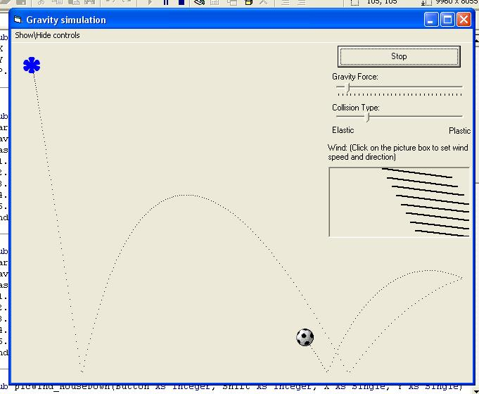



## AA Gravity Simulation \- new features available\!\!

### Description

A gravity simulation of a falling object + Elastic\plastic colision + adjustable Wind effect. New features: Wind, trail, adjustable Colision type and gravity 4ce. plz vote and suggest improvements..
 
### More Info
 

             |
---                |---
**Submitted On**   |2004-06-11 21:17:22
**By**             |[Michael Vainshtein](https://github.com/Planet-Source-Code/PSCIndex/blob/master/ByAuthor/michael-vainshtein.md)
**Level**          |Beginner
**User Rating**    |4.8 (24 globes from 5 users)
**Compatibility**  |VB 3\.0, VB 4\.0 \(16\-bit\), VB 4\.0 \(32\-bit\), VB 5\.0, VB 6\.0
**Category**       |[Graphics](https://github.com/Planet-Source-Code/PSCIndex/blob/master/ByCategory/graphics__1-46.md)
**World**          |[Visual Basic](https://github.com/Planet-Source-Code/PSCIndex/blob/master/ByWorld/visual-basic.md)
**Archive File**   |[AA\_Gravity1756586122004\.zip](https://github.com/Planet-Source-Code/michael-vainshtein-aa-gravity-simulation-new-features-available__1-54342/archive/master.zip)

